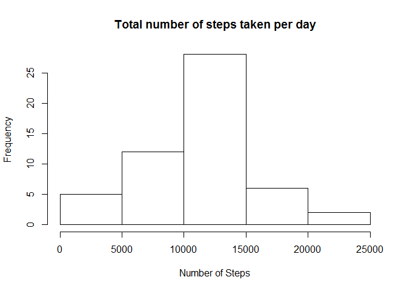
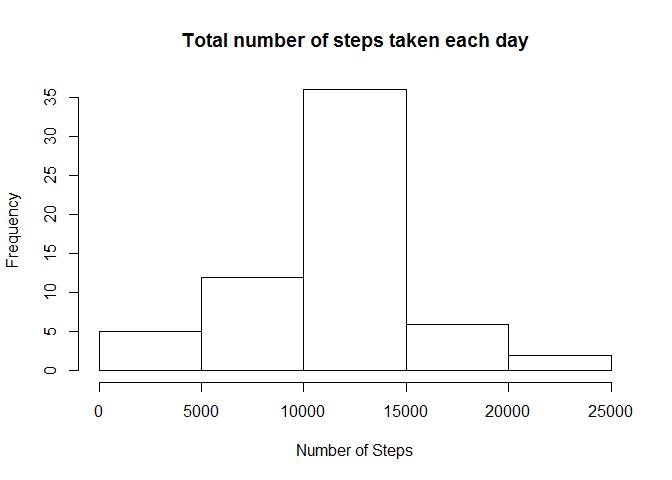
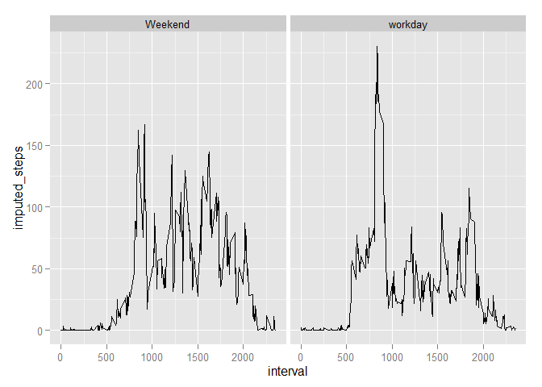

# Reproducible Research: Peer Assessment 1


## Loading and preprocessing the data


```r
act_data <- read.csv("C:/Users/user/Documents/R/Git_Repos/RepData_PeerAssessment1/activity.csv", stringsAsFactors = FALSE)

act_data$date <- as.Date(act_data$date)

str(act_data)
```

```
## 'data.frame':	17568 obs. of  3 variables:
##  $ steps   : int  NA NA NA NA NA NA NA NA NA NA ...
##  $ date    : Date, format: "2012-10-01" "2012-10-01" ...
##  $ interval: int  0 5 10 15 20 25 30 35 40 45 ...
```


## What is mean total number of steps taken per day?

```r
Tot_Num_Step <- aggregate(steps ~ date, data = act_data, sum, na.rm = TRUE)

### Create a histogram of the total number of steps taken each day
hist(Tot_Num_Step$steps, xlab = "Number of Steps" , ylab = , main = "Total number of steps taken per day")
```

 

```r
###the mean and median of the total number of steps taken per day
Mean_Total <- as.integer(mean(Tot_Num_Step$steps))

median_Total <- median(Tot_Num_Step$steps)
```

Mean of the total number of steps taken per day is approximately 10766  
Median of the total number of steps taken per day is 10765


## What is the average daily activity pattern?

```r
##time series plot of the 5-minute interval and the average number of steps taken, averaged across all days (y-axis)
AVG_Num_Step <- aggregate(steps ~ interval, data = act_data, mean, na.rm = TRUE)

with(AVG_Num_Step, plot(interval, steps, type = "l"))
```

 

```r
AVG_Num_Step <- AVG_Num_Step[order(-AVG_Num_Step$steps),]
```

Maximum number of steps is 206 for interval 835


## Imputing missing values

```r
NMissing <- sum(is.na(act_data$steps))
```
Number of rows with missing values is 2304


The Following part will impute missing data based on the mean for the corresponding 5-minute interval

```r
act_data2 <- ddply(act_data, "interval", mutate, imputed_steps = impute(steps, mean))

Tot_Num_Step2 <- aggregate(imputed_steps ~ date, data = act_data2, sum, na.rm = TRUE)

hist(Tot_Num_Step2$imputed_steps, main = "Total number of steps taken each day", xlab = "Number of Steps")
```

 

```r
###Total Number of steps before and after imputation
Tot_Num_Step_B <- as.integer(sum(Tot_Num_Step$steps))

Tot_Num_Step_A <- as.integer(sum(Tot_Num_Step2$imputed_steps))
```

Total Number of steps before imputation is 570608  
Total Number of steps after imputation is  656737


## Are there differences in activity patterns between weekdays and weekends?

```r
##activity patterns between weekdays and weekends
act_data2$Weekdays <- weekdays(act_data2$date)

act_data2$wrkday <- with(act_data2, ifelse(Weekdays== "Saturday","Weekend", ifelse(Weekdays== "Sunday","Weekend", "workday")))

Mean_Num_Step <- aggregate(imputed_steps ~ wrkday + interval, data = act_data2, mean, na.rm = TRUE)

x <- ggplot(Mean_Num_Step,aes(interval,imputed_steps))
x+ geom_line() + facet_grid(.~wrkday)
```

 


